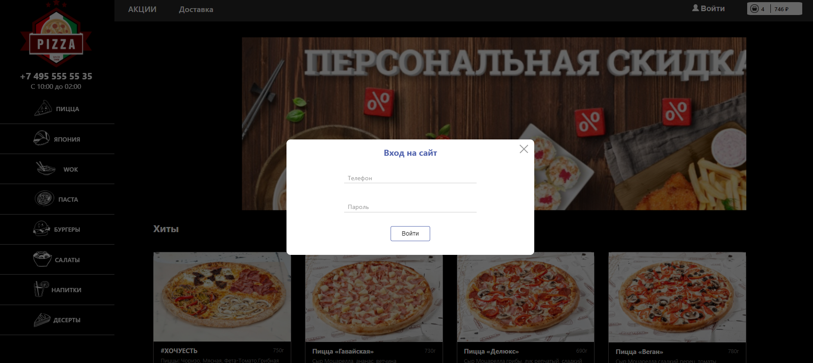
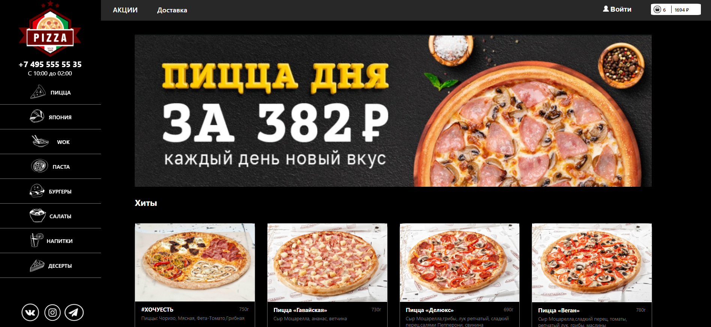
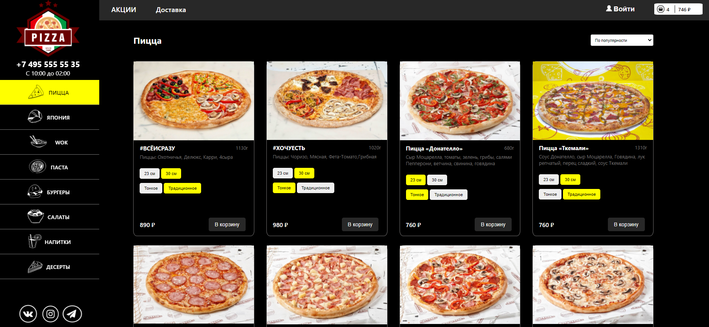
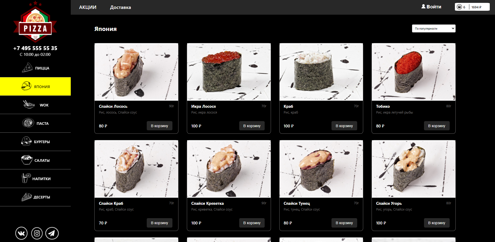
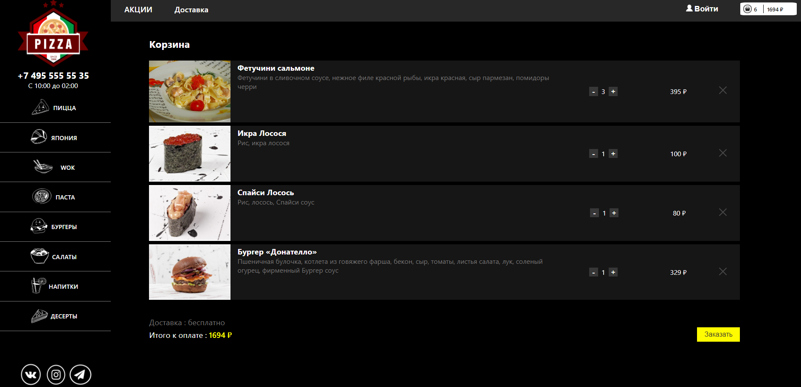
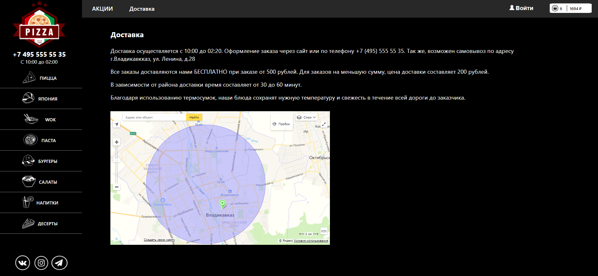
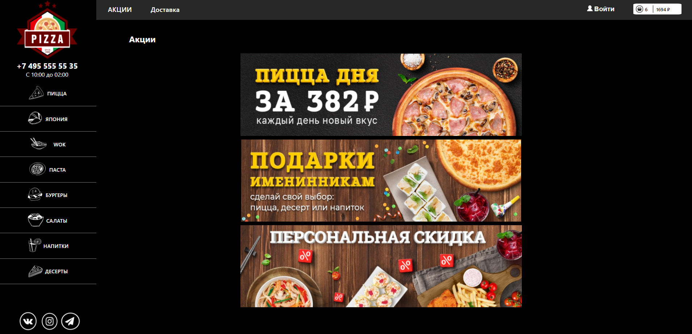

<h1 align="center">PIZZA_SPA</h1>
<h2 align="center">

[](https://github.com/yTemnik/Pizza-spa)

</h2>

## Description

<p align="center">
</p>
Pizza implemented by scratch on React+Redux. User has ability to select desired sections of the menu, add or remove products from the basket, specify how many products he wants to add to the basket.
App contains implementations of map and swiper. 
Next plan is to add forms and authorization.
 Don't judge too harshly, I'm just learning xD.

# Screenshots
## Modal
<p align="center">

</p>

## Swiper
<p align="center">

</p>

## Slide Pizza
<p align="center">

</p>

## Slide Japan
<p align="center">

</p>

## Slide Basket
<p align="center">

</p>

## Slide Map
<p align="center">

</p>

## Slide Promo
<p align="center">

</p>


## Project setup

I am using a local server, so:

First terminal:
```
json-server --watch info.json 
```

Second terminal:
```
npm run start
```
